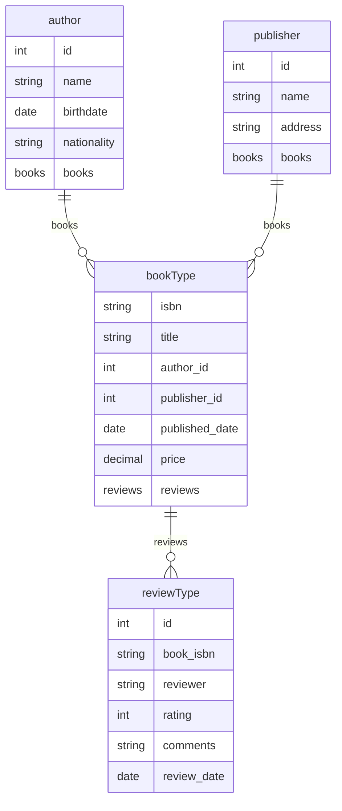

# xsd2erd
XSD 2 ERD

ChatGPT generated code, until I reached a limit and could not improve it.
Then manually adjusted.

Reference: https://mermaid.js.org/syntax/entityRelationshipDiagram.html

## Example

